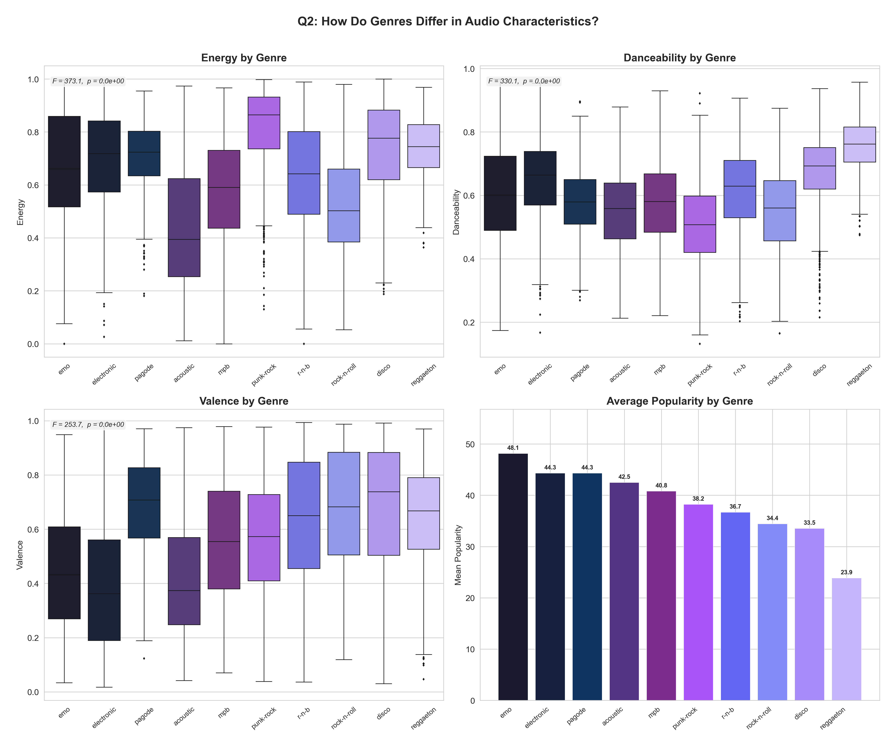

# Spotify Streaming Analytics

Statistical analysis of 114K tracks to understand what drives song popularity and inform playlist optimization strategies.

---

## Overview

This project analyzes 113,549 Spotify tracks using correlation analysis, ANOVA, clustering, and hypothesis testing. The analysis reveals that feature combinations and genre context drive popularity far more than individual audio characteristics.

**Primary finding:** Tracks with both high danceability (>0.7) and high energy (>0.7) represent only 0.66% of the catalog but achieve 2.35x higher average popularity (77.7 vs 33.3), indicating significant untapped value in combination-based filtering.

---

## Key Findings

**Sweet Spot Effect**  
750 tracks (0.66%) with danceability >0.7 AND energy >0.7 achieve 77.7 average popularity vs 33.3 for remaining tracks (2.35x difference, p<0.001)

**Genre Dominance**  
ANOVA reveals genre explains far more variance than individual features (F=132-373, p<0.001). Emo music averages 48.1 popularity while reggaeton averages 23.9 (100% difference).

**Feature Paradox**  
Individual audio features show minimal correlation with popularity. Strongest predictor (instrumentalness) shows r=-0.095, explaining <1% of variance.

**Content Analysis**  
Explicit tracks show 3.5 point higher popularity (t=13.68, p=2.90e-42), representing 10.6% lift. Effect likely confounded by genre preferences (hip-hop).

**Tempo-Mood Patterns**  
Fast & sad songs slightly outperform other combinations (34.8 vs 32.2 popularity, χ²=468, p<0.001), though effect size is modest (8% difference).

---

## Recommendations

**Playlist Optimization**  
Create dedicated editorial playlists targeting the sweet spot zone (danceability >0.7, energy >0.7) for workout and party contexts. Current 0.66% representation could expand to 5-10% in high-energy playlists.

**Algorithm Improvements**  
Implement genre-specific feature thresholds rather than global cutoffs. "High energy" varies by genre (0.85+ for EDM, 0.60+ for acoustic). Genre-blind thresholds introduce systematic bias.

**Feature Engineering**  
Weight feature combinations more heavily than isolated metrics in recommendation scoring. Multi-dimensional clustering captures value that single-feature analysis misses.

**Content Strategy**  
Increase representation of high-performing genres (emo, electronic, pop) in featured playlists while validating regional differences for underperforming genres (reggaeton may reflect dataset bias).

---

## Methodology

**Q1: Audio Feature Correlations**  
Pearson correlation analysis between popularity and 9 audio features (danceability, energy, loudness, speechiness, acousticness, instrumentalness, liveness, valence, tempo). All show r<0.10.

**Q2: Genre Differences**  
One-way ANOVA comparing energy, danceability, and valence distributions across top 10 genres. Highly significant differences (F=132-373, p<0.001).

**Q3: Feature Combinations**  
2D clustering analysis (danceability × energy) to identify high-popularity zones. Sweet spot defined as >0.7 on both dimensions.

**Q4: Explicit Content**  
Welch's t-test comparing explicit (n=9,718) vs clean (n=103,831) tracks. Explicit shows +3.5 points (p=2.90e-42).

**Q5: Tempo-Mood Analysis**  
Quadrant segmentation (tempo × valence) with chi-square test on popularity tiers. Fast & sad quadrant leads (χ²=468, p<0.001).

---

## Results

### Sweet Spot Visualization


Left: Scatter plot showing popularity by danceability and energy. Sweet spot zone (top-right) shows highest concentration of popular tracks.  
Right: Density contour revealing most tracks cluster around moderate values (0.5 danceability, 0.6 energy) while sweet spot is sparsely populated.

### Genre Analysis



Boxplots comparing energy, danceability, and valence across genres. EDM shows highest energy, reggaeton highest danceability, pop/disco highest valence. Emo leads in popularity despite moderate audio features.

### Correlation Matrix


Heatmap and scatter plots showing weak correlations (r<0.10) between individual audio features and popularity. Challenges assumption that sonic quality predicts success.

---

## Technical Details

**Dataset:** 113,549 tracks from Kaggle Spotify dataset  
**Features:** 9 audio characteristics (danceability, energy, loudness, speechiness, acousticness, instrumentalness, liveness, valence, tempo)  
**Methods:** Pearson correlation, one-way ANOVA, Welch's t-test, chi-square test  
**Visualizations:** matplotlib, seaborn (300 DPI)  
**Code:** Reproducible analysis with random_state=42

---

## Project Structure
```
spotify-streaming-analytics/
├── data/
│   └── dataset.csv
├── notebooks/
│   └── spotify_eda.ipynb
├── outputs/
│   ├── figures/
│   │   ├── 01_popularity_correlations.png
│   │   ├── 02_genre_analysis.png
│   │   ├── 03_danceability_energy.png
│   │   ├── 04_explicit_analysis.png
│   │   └── 05_tempo_mood.png
│   └── reports/
│       └── spotify_insights_summary.csv
├── README.md
└── requirements.txt
```

---

## Setup
```bash
git clone https://github.com/nischala16/spotify-streaming-analytics.git
cd spotify-streaming-analytics
pip install -r requirements.txt
jupyter notebook notebooks/spotify_eda.ipynb
```

**Requirements:** pandas, numpy, matplotlib, seaborn, scipy

---

## Key Takeaways

Feature combinations drive popularity more than individual metrics (2.35x effect vs r<0.10 correlations). Genre context matters significantly (F-statistics 132-373 vs weak feature correlations). Small segments can have outsized impact (0.66% of tracks, 2.35x popularity). Individual audio features barely predict success; marketing, artist brand, and playlist placement likely dominate.

---

## Future Work

- Temporal analysis of audio preference shifts (2010-2020 trends)
- A/B test simulation comparing sweet spot vs standard curation
- Integration with collaborative filtering and user behavior data
- Deep learning embeddings for audio similarity beyond hand-crafted features

---

## Contact

[LinkedIn](https://linkedin.com/in/nischala-nagisetty) • [GitHub](https://github.com/nischala16) • nischalanagisetty@gmail.com

---

MIT License
