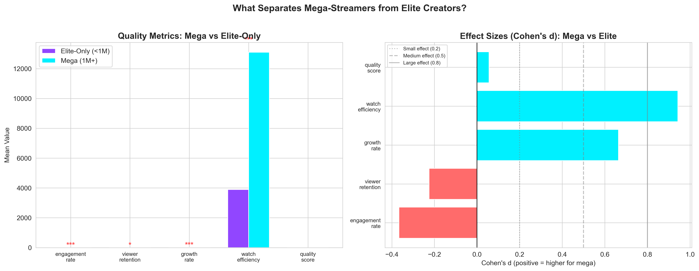
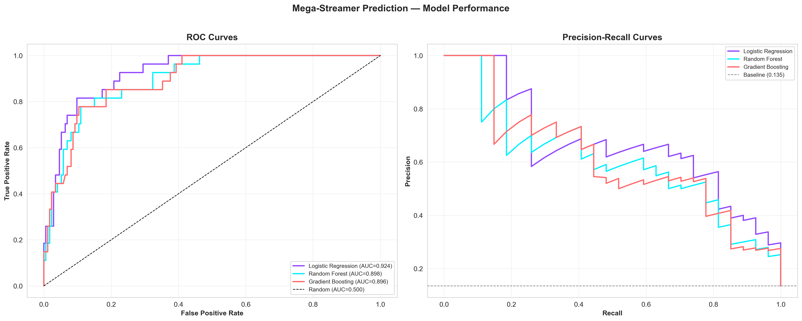
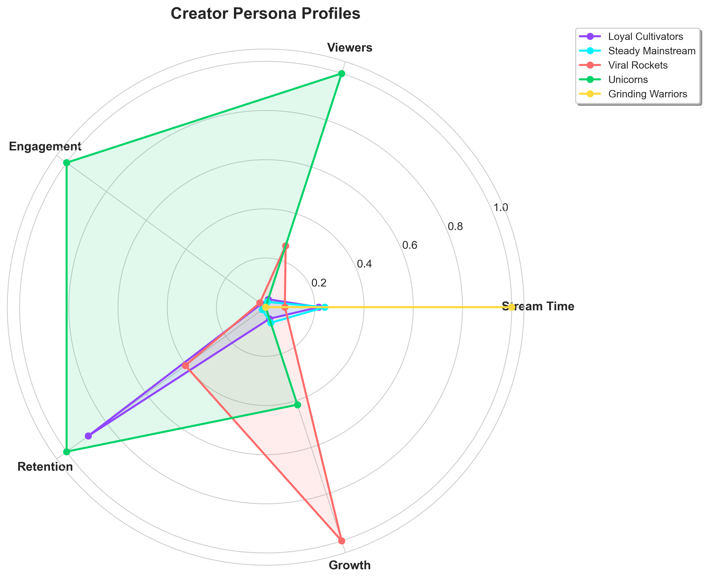

# Twitch Elite Creator Analytics

Predictive modeling and segmentation of the top 1,000 Twitch creators by watch time, representing approximately the top 0.01% of all accounts on the platform. The project answers two questions relevant to gaming platform strategy: which elite creators will break through to mega-streamer status (1M+ followers), and what distinct operational archetypes exist among top performers?

The dataset contains creators with a median of 318,063 followers. Even the lowest-performing creators in this sample vastly outperform the typical Twitch streamer, making this an analysis of differentiation within an already elite population.

---

## Key Findings

**1. Engagement decays with scale.** Mega-streamers have 53% lower engagement rates than sub-1M creators (Spearman rho = -0.496, p < 0.001). Larger audiences are harder to activate, but absolute viewer counts still dominate partnership economics.

**2. Volume predicts mega-status, not quality.** Watch efficiency (Cohen's d = 0.94) and followers gained (r = 0.72) are the strongest predictors. The composite quality score has near-zero correlation with follower count (r = 0.03).

**3. A logistic regression outperforms ensemble methods.** ROC-AUC of 0.924 vs. 0.898 (Random Forest) and 0.896 (Gradient Boosting). The linear separability in this feature space makes added model complexity counterproductive.

**4. Five creator personas emerge from behavioral clustering.** The most striking: Viral Rockets (5.6% of creators) account for a 64.3% mega-streamer rate, while Grinding Warriors (4.3%) stream 7,386 hours on average yet convert at only 0.26 followers per minute. Persona is significantly associated with mega-status (chi-square, p < 0.001).

---

## Project Structure

```
twitch-gaming-analytics/
├── data/
│   ├── twitchdata-update.csv          # Original dataset (Kaggle)
│   └── twitchdata_enriched.csv        # Engineered features + targets
├── notebooks/
│   ├── 01_eda_feature_engineering.ipynb
│   ├── 02_mega_streamer_prediction.ipynb
│   └── 03_creator_personas.ipynb
├── outputs/
│   ├── figures/                       # 14 publication-ready visualizations
│   └── reports/                       # CSV exports (model results, personas)
└── README.md
```

---

## Methodology

### Notebook 1: Exploratory Data Analysis and Feature Engineering

Characterized the elite creator population and engineered six quality metrics from raw platform data:

| Feature | Formula | Correlation with Followers | Mega vs. Elite Difference |
|---|---|---|---|
| growth_rate | followers_gained / stream_time | r = +0.433 | +524% higher for mega |
| watch_efficiency | watch_time / stream_time | r = +0.430 | +236% higher for mega |
| engagement_rate | avg_viewers / followers | r = -0.118 | -54% lower for mega |
| viewer_retention | avg_viewers / peak_viewers | r = -0.079 | -12% lower for mega |
| views_per_follower | views_gained / followers | r = -0.105 | -75% lower for mega |
| quality_score | Composite (MinMax scaled) | r = +0.025 | +3% (not significant) |

Statistical methods: Spearman rank correlation, Welch's t-tests with Cohen's d effect sizes, ANOVA, chi-square tests for categorical associations. Power law concentration measured via Gini coefficient (0.540).

Key structural findings:
- The top 10% of these elite creators hold 42.2% of total followers.
- Log-log regression of stream time vs. followers gained yields a slope of -0.50, confirming diminishing returns: doubling stream hours increases follower gains by roughly 30%.
- 98% of creators in this dataset are Twitch Partners.
- Mature content channels have significantly lower follower counts (t = -3.56, p < 0.001).



### Notebook 2: Mega-Streamer Classification

Binary classification predicting whether a creator has reached 1M+ followers, using an 80/20 stratified train-test split (13.3% positive class rate). All models use class imbalance handling and F1-optimal threshold tuning.

| Model | ROC-AUC | Precision | Recall | F1 | Optimal Threshold |
|---|---|---|---|---|---|
| Logistic Regression | 0.924 | 0.625 | 0.741 | 0.678 | 0.600 |
| Gradient Boosting | 0.896 | 0.538 | 0.778 | 0.636 | 0.585 |
| Random Forest | 0.898 | 0.525 | 0.778 | 0.627 | 0.342 |

Logistic Regression wins on both ROC-AUC and F1. The result is consistent with the EDA finding that the feature-target relationships are strongly linear: followers_gained (r = 0.72), watch_time_minutes (r = 0.62), peak_viewers (r = 0.53).

Feature importance from Gradient Boosting confirms the signal hierarchy:

| Feature | Importance |
|---|---|
| average_viewers | 0.398 |
| followers_gained | 0.328 |
| watch_time_minutes | 0.140 |
| peak_viewers | 0.061 |
| growth_rate | 0.046 |
| All other features | < 0.03 combined |

The top three features account for 86.6% of predictive power. Language dummies and the mature flag contribute under 2% when controlling for growth and viewership metrics.

The model identified 9 elite creators with >70% predicted probability of reaching mega-status, including Pestily (99.2%), LCK (97.2%), TwitchRivals (96.5%), aceu (96.1%), and HasanAbi (90.0%).



### Notebook 3: Creator Persona Clustering

K-Means clustering on five behavioral features (stream time, average viewers, engagement rate, viewer retention, growth rate), with StandardScaler normalization. Silhouette analysis tested K = 2 through 10; K = 5 was selected for business interpretability (silhouette score = 0.354).

| Persona | Count | % of Dataset | Mega Rate | Distinguishing Trait |
|---|---|---|---|---|
| Viral Rockets | 56 | 5.6% | 64.3% | Growth rate 29.8x, minimal hours |
| Steady Mainstream | 566 | 56.6% | 12.4% | Near-average on all dimensions |
| Grinding Warriors | 43 | 4.3% | 9.3% | 7,386 avg hours, 0.26 growth rate |
| Loyal Cultivators | 331 | 33.1% | 6.9% | 1.6x retention, community-focused |
| Unicorns | 4 | 0.4% | 0.0% | 26x engagement, event-driven outliers |

Viral Rockets convert to mega-status at 4.8x the overall rate despite averaging only 733 streaming hours, while Grinding Warriors log 7,386 hours but grow at 0.26 followers per minute -- a 115x efficiency gap.



---

## Business Implications

**Partnership acquisition.** The classification model provides a 6x improvement over random selection for identifying future mega-streamers. At a $50K per-creator partnership cost, prioritizing the 9 high-confidence candidates over broad outreach reduces wasted spend significantly.

**Persona-specific support.** Platform resources should not be allocated uniformly:
- Viral Rockets need fast-track partnerships before competitor platforms recruit them.
- Grinding Warriors need efficiency tools and burnout prevention; more hours will not drive proportional growth.
- Loyal Cultivators benefit from community and subscriber features that monetize their high retention.
- Steady Mainstream creators need differentiation strategy to avoid plateau.

**Talent scouting.** False positives from the classification model (elite creators predicted as mega who haven't crossed 1M yet) are not errors in a business context -- they are rising stars. TwitchRivals (999K followers, 96.5% predicted probability) and aceu (859K, 96.1%) are actionable acquisition targets.

---

## Technical Details

**Languages and Libraries**
- Python 3.9+
- pandas, NumPy, scikit-learn, SciPy, matplotlib, seaborn

**Statistical Methods**
- Spearman rank correlation, Welch's t-tests, one-way ANOVA, chi-square tests of independence
- Cohen's d effect sizes, Gini coefficient, log-log regression

**Machine Learning**
- Classification: Logistic Regression, Random Forest, Gradient Boosting with GridSearchCV (5-fold stratified CV), class_weight balancing, F1-optimal threshold tuning
- Clustering: K-Means with elbow method and silhouette analysis, PCA for 2D visualization

**Outputs**
- 14 visualizations at 300 DPI
- 11 CSV reports (model comparisons, feature importance, persona assignments, partnership priorities)

---

## How to Run

```bash
# Clone the repository
git clone https://github.com/your-username/twitch-gaming-analytics.git
cd twitch-gaming-analytics

# Install dependencies
pip install pandas numpy scikit-learn scipy matplotlib seaborn

# Run notebooks in order
jupyter notebook notebooks/01_eda_feature_engineering.ipynb
jupyter notebook notebooks/02_mega_streamer_prediction.ipynb
jupyter notebook notebooks/03_creator_personas.ipynb
```

Notebooks must be run sequentially. Notebook 1 generates `twitchdata_enriched.csv`, which is consumed by Notebooks 2 and 3.

---

## Data Source

[Top 1000 Twitch Streamers](https://www.kaggle.com/datasets/aayushmishra1512/twitchdata) -- Kaggle dataset of the top 1,000 Twitch channels ranked by watch time, including follower counts, viewership metrics, streaming hours, language, and partnership status.

---

## License

This project is for portfolio and educational purposes.

